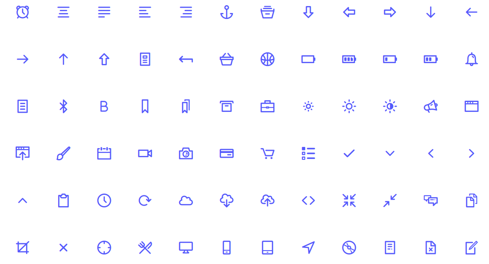
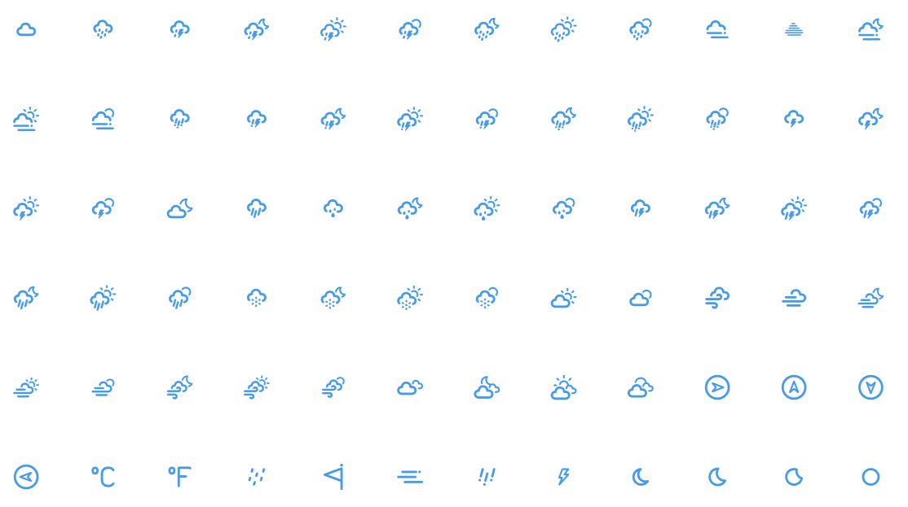

# DripiIcons Icon
DripIcons Flutter 

#### Thanks to authors of Dripicons [Amit Jakhu](https://github.com/amitjakhu/dripicons)

##### DripiIcons 


##### DripiIcons Weather 


## Usage
```dart
class MyHomePage extends StatelessWidget {
  @override
  Widget build(BuildContext context) {
    return Scaffold(
      body: Column(
        children: [
          Icon(
            DripIcons.alarm,
            size: 100,
            color: Colors.blue,
          ),
          Icon(
            DripIconsWeather.cloud_2,
            size: 100,
            color: Colors.blue,
          ),
        ],
      ),
    );
  }
}
```
## Example

```dart
import 'package:flutter/material.dart';
import 'package:windows_icon/windows_icon.dart';

void main() {
  runApp(MyApp());
}

class MyApp extends StatelessWidget {
  @override
  Widget build(BuildContext context) {
    return MaterialApp(
      title: 'DripIcons',
      theme: ThemeData(
        primarySwatch: Colors.blue,
      ),
      home: MyHomePage(),
    );
  }
}

class MyHomePage extends StatelessWidget {
  @override
  Widget build(BuildContext context) {
    return Scaffold(
      body: Column(
        children: [
          Icon(
            DripIcons.alarm,
            size: 100,
            color: Colors.blue,
          ),
          Icon(
            DripIconsWeather.cloud_2,
            size: 100,
            color: Colors.blue,
          ),
        ],
      ),
    );
  }
}
```